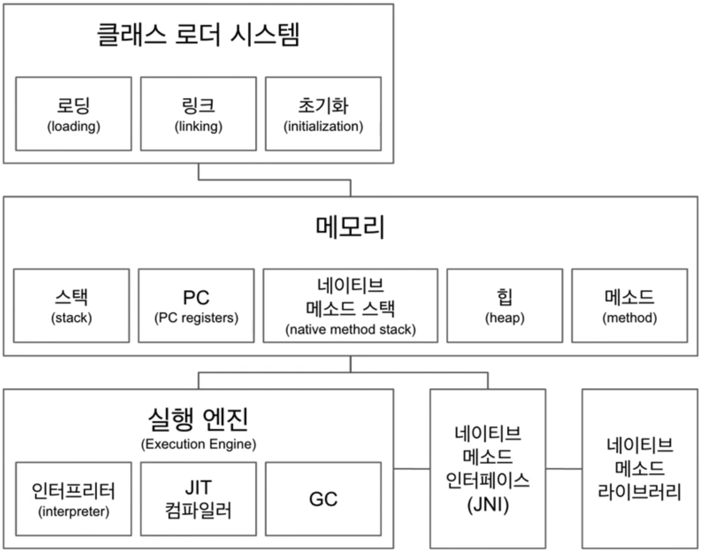
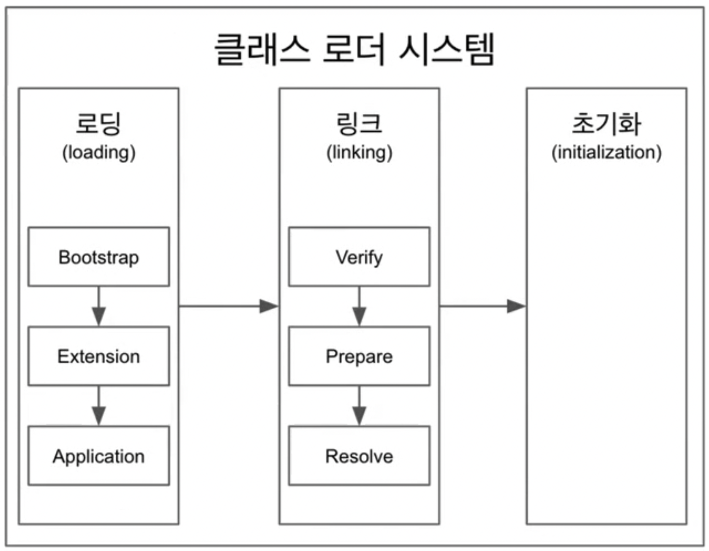

# 백기선님 더 자바, 코드를 조작하는 다양한 방법 스터디

## Java, JVM, JDK, JRE

### JVM(Java Virtual Machine)

- 자바 가상 머신으로 자바 바이트 코드(.class 파일)를 OS에 특화된 코드로 변환(인터프리터와 JIT 컴파일러)하여 실행한다.
- 바이트 코드를 실행하는 표준(JVM 자체는 표준)이자 구현체(특정 밴더가 구현한 JVM)다.
- JVM 스팩: [https://docs.oracle.com/javase/specs/jvms/se11/html/](https://docs.oracle.com/javase/specs/jvms/se11/html/)
- JVM 밴더: 오라클, 아마존, Azul, ...
- 특정 플랫폼에 종속적
- javap -C 클래스파일
- 클래스 로더, 메모리에 할당, 메모리 관리, 실행 등

### JRE(Java Runtime Environment)

- 자바 애플리케이션을 실행할 수 있도록 구성된 배포판
- JVM과 핵심 라이브러리 및 자바 런타임 환경에서 사용하는 프로퍼티 세팅이나 리소스 파일을 가지고 있다.(JVM + 라이브러리)
- 개발 관련 도구는 포함하지 않는다.(개발 관련 도구는 JDK에서 제공한다.)

### JDK(Java Development Kit)

- JRE + 개발에 필요한 툴
- 소스 코드를 작성할 때 사용하는 자바 언어는 플랫폼에 독립적
- 오라클은 자바 11부터는 JDK만 제공하며 JRE를 따로 제공하지 않는다.
- jlink(java module system, java 9부터 적용) 으로 모듈 서브셋을 만들 수 있다.(커스텀 jre와 같은)

### Java

- 프로그래밍 언어
- JDK에 들어있는 자바 컴파일러(javac)를 사용하여 바이트코드(.class 파일)로 컴파일 할 수 있다.
- 오라클 JDK 11 버전부터 상용으로 사용할 때 유료. 오라클 openJDK는 무료.
    - [https://medium.com/@javachampions/java-is-still-free-c02aef8c9e04](https://medium.com/@javachampions/java-is-still-free-c02aef8c9e04)

### JVM 언어

- JVM 기반으로 동작하는 프로그래밍 언어
- 클로저, 그루비, JRuby, Jython, Kotlin, Scala, ...

    ```kotlin
    // Hello.kt
    fun main(args: Array<String>) {
        println("Hello, Kotlin")
    }
    // $ kotlinc Hello.kt -include-runtime -d hello.jar
    // $ java -jar hello.jar
    ```

### 참고

- JDK, JRE, JVM: [https://howtodoinjava.com/java/basics/jdk-jre-jvm/](https://howtodoinjava.com/java/basics/jdk-jre-jvm/)
- JIT 컴파일러

## JVM 구조



### JVM은 5가지 컴포넌트로 구성

- 클래스 로더 시스템
- 메모리
- 실행 엔진
- 네이티브 메서드 인터페이스(JNI)
- 네이티브 메서드 라이브러리

### 1. 클래스 로더 시스템

.class 에서 바이트코드를 읽고 메모리에 저장

- 로딩(Loading): 클래스 읽어오는 과정
- 링크(Linking): 레퍼런스를 연결하는 과정
- 초기화(Initialization): static 값들 초기화하고 변수에 할당하는 과정

### 2. 메모리

- 스택(Stack) : 쓰레드마다 런타임 스택을 만들고 그 안에 스택 프레임이라고 부르는 메소드 호출을 블럭으로 쌓는다. 쓰레드를 종료하면 런타임 스택도 사라진다.
- PC(Program counter registers) : 쓰레드마다 쓰레드 내 현재 실행할 스택 프레임을 가리키는 포인터가 생성된다.
- 네이티브 메소드 스택(Native method stack) : Native method에 대한 스택을 저장한다.
- 힙(Heap) : Instance를 저장하는 공유자원이다.
- 메소드(Method) : 클래스 수준의 정보(클래스 이름, 부모 클래스 이름, 메소드, 변수)를 저장하는 영역고 공유자원이다. static으로 선언된 것들도 이 영역에 저장된다.
- Runtime Constant Pool : 클래스나 인터페이스가 만들어질 때 메소드 영역에 생기며 각 클래스나 인터페이스마다 Constant pool table을 가지고 있다.

    ```java
    public static native Thread currentThread();
    ```

- [https://javapapers.com/core-java/java-jvm-run-time-data-areas/](https://javapapers.com/core-java/java-jvm-run-time-data-areas/)

### 3. 실행 엔진

- 인터프리터: 바이트코드를 할줄 씩 실행
- JIT 컴파일러: 인터프리터 효율을 높이기 위해, 인터프리터가 반복되는 코드를 발견하면 JIT 컴파일러로 반복되는 코드를 모두 네이티브 코드로 바꿔둔다. 그 다음부터 인터프리터는 네이티브 코드로 컴파일된 코드를 바로 사용한다.
- GC(Garbage Collector): 더이상 참조되지 않는 객체를 모아서 정리한다. Stop-the-world Collector와 Throughput Collector가 있다.

### 4. JNI(Java Native Interface)

- 자바 애플리케이션에서 C, C++, 어셈블리로 작성된 함수를 사용할 수 있는 방법을 제공하는 인터페이스
- native 키워드를 사용한 메서드 호출
- [https://schlining.medium.com/a-simple-java-native-interface-jni-example-in-java-and-scala-68fdafe76f5f](https://schlining.medium.com/a-simple-java-native-interface-jni-example-in-java-and-scala-68fdafe76f5f)

### 5. 네이티브 메서드 라이브러리

- C, C++로 작성된 라이브러리

## 클래스 로더



**클래스 로더**는 .class 파일에서 바이트코드를 읽어 메모리에 저장하는 시스템으로 로딩(Loading), 링크(Linking), 초기화(Initialization) 과정을 수행한다.

- 로딩
  - 클래스 로더가 .class 파일을 읽고 그 내용에 따라 적절한 바이너리 데이터를 만들고 “메서드" 영역에 클래스 정보를 저장
  - 이때 메서드 영역에 저장하는 데이터
    - FQCN(Fully Qualified Class Name): 클래스가 속한 패키지명을 모두 포함한 이름
    - 클래스 | 인터페이스 | 이늄
    - 메서드, 변수
  - 로딩이 끝나면 해당 클래스 타입의 Class 객체를 생성하여 “힙" 영역에 저장. ex) Class<Foo> 타입의 객체
- 링크
  - Verify, Prepare, Resolve(optional) 세 단계로 나눠져있다.
  - 검증: .class 파일 형식이 유효한지 체크한다.
  - Preparation: 클래스 변수(static 변수)와 기본값에 필요한 메모리 영역을 준비
  - Resolve(optional): 심볼릭 메모리 레퍼런스를 메서드 영역에 있는 실제 레퍼런스로 교체한다.
- 초기화
  - static 변수의 값을 할당한다.(static 블럭이 있다면 이때 실행된다.)
- 클래스 로더는 계층 구조로 이뤄져 있으며 기본적으로 세가지 클래스 로더가 제공된다.
  - 부트 스트랩 클래스 로더(Bootstrap class loader): JAVA_HOME/lib 에 있는 코어 자바 API를 제공한다. 최상위 우선순위를 가진 클래스 로더
  - 플랫폼 클래스 로더(Extension(Platform) class loader): JAVA_HOME/lib/ext 폴더 또는 java.ext.dirs 시스템 변수에 해당하는 위치에 있는 클래스를 읽는다.
  - 애플리케이션 클래스 로더(Application class loader): 애플리케이션 클래스패스(애플리케이션 실행할 때 주는 -classpath 옵션 또는 java.class.path 환경 변수의 값에 해당하는 위치)에서 클래스를 읽는다

## 바이트코드 조작

### 코드 커버리지는 어떻게 측정하는 걸까?

코드 커버리지? 테스트 코드가 확인한 소스 코드 % 확인

- JaCoCo를 써보자
- 플러그인 추가

    ```java
    plugins {
        id 'java'
        id 'jacoco'
    }
    
    group 'org.example'
    version '1.0-SNAPSHOT'
    
    repositories {
        mavenCentral()
    }
    
    dependencies {
        testImplementation 'org.junit.jupiter:junit-jupiter-api:5.8.1'
        testRuntimeOnly 'org.junit.jupiter:junit-jupiter-engine:5.8.1'
    }
    
    test {
        useJUnitPlatform()
        finalizedBy 'jacocoTestReport' // 추가
    }
    
    jacoco {
        toolVersion = '0.8.7'
    //    reportsDir = ${project.reporting.baseDir}/jacoco
    }
    
    jacocoTestReport {
        reports {
            html.enabled true
            csv.enabled true
            xml.enabled false
        }
        finalizedBy 'jacocoTestCoverageVerification' // 추가
    }
    
    jacocoTestCoverageVerification {
        violationRules {
            rule {
                enabled = true
                element = 'CLASS'
    
                limit {
                    counter = 'LINE'
                    value = 'COVEREDRATIO'
                    minimum = 0.50
                }
    
                limit {
                    counter = 'BRANCH'
                    value = 'COVEREDRATIO'
                    minimum = 0.50
                }
    
                excludes = []
            }
        }
    }
    ```

    ```java
    package org.example;
    
    public class Moim {
        int maxNumberOfAttendees;
        int numberOfEnrollment;
    
        public boolean isEnrollmentFull() {
            if (maxNumberOfAttendees == 0) {
                return false;
            }
    
            if (numberOfEnrollment < maxNumberOfAttendees) {
                return false;
            }
    
            return true;
        }
    }
    ```

    ```java
    package org.example;
    
    import org.junit.jupiter.api.Assertions;
    import org.junit.jupiter.api.Test;
    
    class MoimTest {
        @Test
        void isFull() {
            Moim moim = new Moim();
            moim.maxNumberOfAttendees = 100;
            moim.numberOfEnrollment = 10;
            Assertions.assertFalse(moim.isEnrollmentFull());
        }
    }
    ```

  그래들 Tasks > verification > test 실행하면 build/reports/jacoco/test/html/index.html 생성된다.

  브라우저에서 코드 커버리지 확인


### Javaagent 사용하기

- Javaagent JAR 파일 만들기
  - [https://docs.oracle.com/javase/8/docs/api/java/lang/instrument/package-summary.html](https://docs.oracle.com/javase/8/docs/api/java/lang/instrument/package-summary.html)
  - 붙이는 방식은 시작시 붙이는 방식 premain과 런타임 중에 동적으로 붙이는 방식 agentmain이 있다.
  - Instrumentation을 사용한다.
- Javaagent 붙여서 사용하기
  - 클래스로더가 클래스를 읽어올 때 javaagent를 거쳐서 변경된 바이트코드를 읽어들여 메모리에 올려서 사용한다.
  - 클래스를 직접 바꾸는 방법보다 더 Transparent 비침투적이다.

소스코드의 커버리지를 바이트코드의 조작으로 측정 가능하다. ([JaCoCo](https://www.eclemma.org/jacoco/)와 같은 라이브러리 활용)

다음 라이브러리들을 사용하여 바이트코드의 조작을 할 수 있다.

- [ASM](https://asm.ow2.io/)
- [Javassist](https://www.javassist.org/)
- [ByteBuddy](https://bytebuddy.net/) (추천)

바이트코드를 조작하는 방식은 다양하게 할 수 있다.

1. .class 파일의 내용을 변경하여 조작할 수 있다. 이렇게 할 경우에는 Instance를 로드할 때 이미 기존 바이트코드의 정보가 메모리에 올라가므로 .class 파일의 바이트코드를 변경 후 동작하는 소스를 실행도록 해야하는 불편함이 있다.
2. 클래스를 로딩할 때 바이트코드를 변경하여 메모리에 올리는 방식으로도 조작할 수 있다. 이 방식은 코드의 순서에 종속되기 때문에 다른 클래스에서 이미 해당 인스턴스를 메모리에 올렸을 경우에는 바이트코드를 변경하지 않고 올라갈 수 있는 문제점이 있다.
3. `javaagent`를 활용하여 클래스 로드시 바이트코드를 변경하여 메모리에 올리도록 할 수 있다. 기존 코드를 건드리지 않아도 되어서 Transparent(비침투적) 하다.

바이트코드의 조작으로 활용할 수 있는 예시는 다음과 같다.

- 프로그램 분석
  - 코드에서 버그를 찾는 툴
  - 코드 복잡도 개선
- 클래스 파일 생성
  - 프록시
  - 특정 API 호출 접근 제한
  - 스칼라 같은 언어의 컴파일러
- 자바 소스코드를 건드리지 않고 코드 변경이 필요한 경우
  - 프로파일러
  - 최적화
  - 로깅
  - ...

스프링의 경우에는 컴포넌트 스캔시 바이트코드를 활용한다.(asm)

- 컴포넌트 스캔으로 빈으로 등록할 후보의 클래스 정보를 찾는데 활용
- ClassPathScanningCandidateComponentProvider -> SimpleMetadataReader
- ClassReader와 Visitor를 사용해서 클래스에 있는 메타정보를 읽어온다.

바이트코드를 조작하려면 visitor pattern을 사용할 수 밖에 없다.

## 리플렉션 API

[리플렉션이란?](https://ko.wikipedia.org/wiki/%EB%B0%98%EC%98%81_(%EC%BB%B4%ED%93%A8%ED%84%B0_%EA%B3%BC%ED%95%99))[Java의 Reflection 가이드](https://docs.oracle.com/javase/tutorial/reflect/index.html)

### 클래스

Java에서는 리플렉션을 `Class<?>` 인스턴스로 접근 가능하다.

`Class<?>` 인스턴스를 사용할 수 있는 방법은 아래와 같다.

- 모든 클래스를 로딩한 다음 Class<T>의 인스턴스가 생긴다. “타입.class”로 접근할 수 있다.

    ```java
    Class<Book> bookClass = Book.class;
    ```

- 모든 인스턴스는 getClass() 메서드를 가지고 있다. “인스턴스.getClass()”로 접근할 수 있다.

    ```java
    Book book = new Book();
    Class<? extends Book> aClass = book.getClass();
    ```

- 클래스를 문자열로 읽어오는 방법 - Class.forName(”FQCN”) - throw ClassNotFoundException

    ```java
    Class<?> bClass = Class.forName("me.whiteship.Book");
    ```


### 애너테이션

어노테이션도 리플렉션으로 조회가 가능하다.

다음과 같이 어노테이션을 정의할 수 있는데

```java
@Retention(RetentionPolicy.RUNTIME)
@Target({ElementType.TYPE, ElementType.FIELD})
@Inherited
public @interface MyAnnotation {
    String value();
    int number() default 100;
}

@MyAnnotation("value1") // 애너테이션 변수명이 value 인 경우 설정할때 이름 없어도 된다.
@MyAnnotation(number = 1) // 여러 변수를 설정하거나, 변수명이 value 가 아니면 변수명 = 값 으로 설정
```

각각의 의미는 다음과 같다.

- `@Retention(RetentionPolicy.RUNTIME)` : `.class` 파일에 어노테이션 정보가 들어가고 메모리에도 추가된다.
  해당 애너테이션을 언제까지 유지할 것인가? 소스(컴파일 할때 까지 유지), 클래스(바이트코드 까지 유지), 런타임(실행까지 유지)
- `@Target({ElementType.TYPE, ElementType.FIELD})` : 어노테이션을 사용할 수 있는 곳은 클래스와 필드이다.
  어디에 사용할 수 있는가?
- `@Inherited` : 클래스의 상속관계에서 어노테이션도 상속한다.
  해당 애너테이션을 하위 클래스까지 전달할 것인가?

애너테이션은 근본적으로 주석과 같은 취급을 받는다.

애너테이션 정보는 소스와 클래스에는 남아있는데 바이트코드(클래스)를 로딩 했을때는 메모리에는 남지 않는다.

Book.class.getAnnotations() 하면 조회되지 않는다. Retention을 RUNTIME으로 줘야 바이트코드에 남아있는다.

javap -c -v Book

Retention 설정 후 -v 옵션으로 바이트코드를 보면 애너테이션 정보도 나온다.

Book.class.getDeclaredAnnotations() 상속을 제외한 자신의 애너테이션만 조회

### 클래스 정보 수정

리플렉션하여 인스턴스를 생성하거나 클래스 정보를 수정, 실행할 수 있다. 이를 응용하여 DI(Dependency Injection)을 구현해 볼 수 있다.

- 클래스 인스턴스 만들기
  - Class.newInstance()는 deprecated 됐으며 이제부터는 생성자를 통해서 만들어야 한다.
- 생성자로 인스턴스 만들기
  - Constructor.newInstance(params)
- 필드 값 접근하기/설정하기
  - 특정 인스턴스가 가지고 있는 값을 가져오는 것이기 때문에 인스턴스가 필요하다.
  - Field.get(object)
  - Field.set(object, value)
  - static 필드를 가져올 때는 object가 없어도 되니까 null을 넘기면 안된다.
- 메서드 실행하기
  - Object Method.invoke(object, params)

### DI 프레임워크

```java
public class IocContainerService {
public static <T> T getObject(Class<T> classType) {
        T instance = createInstance(classType);
        Arrays.stream(classType.getDeclaredFields()).forEach(field -> {
            Inject annotation = field.getAnnotation(Inject.class);
            if (annotation != null) {
                Class<?> type = field.getType();
                Object fieldInstance = createInstance(type);
                field.setAccessible(true);
                try {
                    field.set(instance, fieldInstance);
                } catch (IllegalAccessException e) {
                    throw new RuntimeException(e);
                }
            }
        });

        return instance;
    }

    private static <T> T createInstance(Class<T> classType) {
        try {
            return classType.getConstructor(null).newInstance();
        } catch (InstantiationException | IllegalAccessException | InvocationTargetException | NoSuchMethodException e) {
            throw new RuntimeException(e);
        }
    }
}
```

리플렉션할 때 다음과 같은 사항을 유의해야 한다.

- 지나친 사용은 성능 이슈를 야기할 수 있다. 반드시 필요한 경우에만 사용하자.
- 컴파일 타임에는 확인되지 않고 런타임 시에만 발생하는 문제를 만들 가능성이 있다.
- 접근 지시자를 무시할 수 있다.

리플렉션을 활용하는 경우는 다음과 같다.

- 스프링
  - 의존성 주입
  - MVC 뷰에서 넘어온 데이터를 객체에 바인딩 할 때
- 하이버네이트
  - @Entity 클래스에 Setter가 없으면 리플렉션을 활용하여 값을 설정한다.
- [JUnit](https://junit.org/junit5/docs/5.0.3/api/org/junit/platform/commons/util/ReflectionUtils.html)

## 다이나믹 프록시 기법

### 스프링 데이터 JPA는 어떻게 동작하는가?

`Repository`를 생성할 때 `interface`로 정의하고 어노테이션도 달아주지 않는데도 instance가 생성되어 사용할 수 있다.

스프링 데이터 JPA는 Spring AOP를 기반으로 동작하며 RepositoryFactorySupport에서 프록시를 생성한다.

### 프록시 패턴


- 프록시와 리얼 서브젝트가 공유하는 인터페이스가 있고, 클라이언트는 해당 인터페이스 타입으로 프록시를 사용한다.
- 클라이언트는 프록시를 거쳐서 리얼 서브젝트를 사용하기 때문에 프록시는 리얼 서브젝트에 대한 접근을 관리하거나 부가기능을 제공하거나, 리턴값을 변경할 수도 있다.
- 리얼 서브젝트는 자신이 해야 할 일만 하면서(SRP) 프록시를 사용해서 부가적인 기능(접근 제한, 로깅, 트랜잭션, 등)을 제공할 때 이런 패턴을 주로 사용한다.

프록시 패턴이란? 실제 인스턴스의 코드에는 변경을 가하지 않으면서 동작을 변경할 수 있는 패턴이다.

이는 실제 인스턴스와 인터페이스를 공유하는 프록시 인스턴스를 생성하여 추가적인 동작 및 실제 동작을 위임할 수 있다.

클라이언트 입장에서도 코드가 변경되지 않으면서 기능의 변경이 가능하다.

- 단점
  - 기능이 변경될때마다 프록시가 추가/변경 되어야 한다.
  - 구현체에서 원래의 타겟으로 위임하는 코드가 중복되서 발생할 수 있다.
  - 부가 기능이 동일한 경우 유사한 코드가 늘어난다.

### 다이나믹 프록시

다이나믹 프록시란? 런타임에 특정 인터페이스 또는 클래스의 프록시 인스턴스 또는 클래스를 만들어서 사용하는 프로그래밍 기법이다.

다이나믹 프록시 사용처

- 스프링 데이터 JPA
- 스프링 AOP
- Mockito
- 하이버네이트 lazy initialization
- ...

[Java의 Dynamic Proxy 가이드](https://docs.oracle.com/javase/8/docs/technotes/guides/reflection/proxy.html)

프록시 패턴을 직접 구현하는 경우에 프록시 클래스를 직접 구현해야하고 코드량이 많아지는 문제점이 있다.

이에 자바에서 [Proxy 클래스](https://docs.oracle.com/javase/8/docs/api/java/lang/reflect/Proxy.html)를 제공하고 있고 이를 사용하면 런타임 시 동적으로 기능을 추가할 수 있다.

```java
BookService bookService = (BookService) Proxy.newProxyInstance(BookService.class.getClassLoader(), new Class[]{BookService.class},
    new InvocationHandler() {
        BookService bookService = new DefaultBookService();
        @Override
        public Object invoke(Object proxy, Method, method, Object[] args) throws Throwable {
            if (method.getName().equals("rent")) {
                System.out.println("aaaa");
                Object invoke = method.invoke(bookService, args);
                System.out.println("bbbb");
                return invoke;
            }

            return method.invoke(bookService, args);
        }
    });
```

이 방식의 문제는 InvocationHandler 가 유연하지 않아서 코드가 계속 커질 수 있고 또 다른 프록시로 감싸야 할 수도 있다. 또한 Proxy.newProxyInstance의 두번째 매개변수 Class<?> interfaces가 인터페이스가 아니면(클래스면) 다이나믹 프록시를 생성할 수 없다.

그래서 위의 구조를 뜯어고친 프록시 기반의 스프링 AOP가 있다.

### 클래스의 프록시가 필요하다면?

클래스의 프록시가 필요한 경우에는 이전 프록시 패턴에서 언급했던 거와 같이 서브 클래스를 구현함으로써 사용할 수 있고 사용할 수 있는 라이브러리는 아래와 같이 두가지가 있다.

- CGlib 라이브러리를 활용하는 방법
- ByteBuddy를 활용하는 방법
1. [CGlib](https://github.com/cglib/cglib/wiki)

   스프링과 하이버네이트가 사용하는 라이브러리이다.

    ```java
    MethodInterceptor handler = new MethodInterceptor() {
        BookService bookService = new DefaultBookService();
        @Override
        public Object intercept(Object interceptor, Method, method, Object[] args, MethodProxy methodProxy) throws Throwable {
                if (method.getName().equals("rent")) {
                    System.out.println("aaaa");
                    Object invoke = method.invoke(bookService, args);
                    System.out.println("bbbb");
                    return invoke;
                }
    
                return method.invoke(bookService, args);
            }
        });
    
    BookService bookService = (BookService) Enhancer.create(BookService.class, handler);
    ```
2. ByteBuddy

   바이트 코드의 조작 뿐만이 아니라 런타임(다이나믹) 프록시를 만들 때도 사용할 수 있다.

    ```java
    Class<? extends BookService> proxyClass = new ByteByddy().subclass(BookService.class)
        .method(named("rent")).intercept(IncovationHandlerAdapter.of(new InvocationHandler() {
            BookService bookService = new BookService();
            @Override
            public Object invoke(Object proxy, Method, method, Object[] args) throws Throwable {
                System.out.println("aaaa");
                Object invoke = method.invoke(bookService, args);
                System.out.println("bbbb");
                return invoke;
            }
        }))
        .make().load(BookService.class.getclassLoader()).getLoaded();
    
    BookService bookService = proxyClass.getConstructor(null).newInstance();
    ```

스프링 AOP는 자바가 제공하는 다이나믹 프록시만 쓰는게 아니라, 스프링 빈 중에서 인터페이스가 없는 클래스 기반의 빈에 AOP를 적용할 때는 CGlib으로 상속을 사용한 프록시를 만들어서 적용을 한다.

- 서브 클래스를 만드는 방법의 단점
  - 상속을 사용하지 못하는 경우 프록시를 만들 수 없다.
    - private 기본 생성자만 있는 경우
    - final 클래스인 경우
  - 인터페이스가 있을 때는 인터페이스의 프록시를 만들어서 사용하는것을 추천한다.

## 애너테이션 프로세서

### Lombok

@Getter, @Setter, @Builder 등의 애너테이션과 애너테이션 프로세서를 제공하여 표준적으로 작성해야 할 코드를 생성해주는 라이브러리

컴파일 시점에 애너테이션 프로세서를 사용하여 소스코드의 AST(Abstract Syntax Tree)를 조작한다.

[Java의 Processor Interface 가이드](https://docs.oracle.com/javase/8/docs/api/javax/annotation/processing/Processor.html)

- 롬복 사용하기
  - 의존성 추가
  - IntelliJ lombok 플러그인 설치
  - Intellij Annotation Processing 옵션 활성화
- 논란
  - 공개된 API가 아닌 컴파일러 내부 클래스를 사용하여 기존 소스 코드를 조작한다.
  - 이클립스의 경우 java agent를 사용하여 컴파일러 클래스까지 조작하여 사용한다. 해당 클래스들 역시 공개된 API가 아니다보니 버전 호환성에 문제가 생길 수 있다.
  - 그럼에도 불구하고 편리성 때문에 널리 쓰이고 있으며 대안이 몇가지 있지만 롬복의 모든 기능과 편의성을 대체하진 못한다.
    - AutoValue - [https://github.com/google/auto/blob/master/value/userguide/index.md](https://github.com/google/auto/blob/master/value/userguide/index.md)
    - Immutables - [https://immutables.github.io/](https://immutables.github.io/)

### 애너테이션 프로세서

애너[테이션 프로세싱](http://hannesdorfmann.com/annotation-processing/annotationprocessing101)은 컴파일 시간에 애너테이션들을 스캐닝하고 프로세싱하는 javac로 작성된 툴이다.

애너테이션 **프로세서**란? 애너테이션 프로세싱을 하기 위한 주체이다. 따라서 애너테이션 프로세서를 구현함으로써 컴파일 타임에 추가적인 동작을 정의할 수 있다.

Processor 인터페이스: 여러 라운드(rounds)에 거쳐 소스 및 컴파일 된 코드를 처리할 수 있다.

`AbstractProcessor`를 상속받아서 애너테이션 프로세서를 구현할 수 있다.

```java
@AutoService(Processor.class) // /META-INF/services/javax.annotation.processing.Processor 파일을 생성하고 이 클래스의 FQCN 을 등록해준다.
public class MagicMojaProcessor extends AbstractProcessor {
    @Override
    public Set<String> getSupportedAnnotationTypes() {
        return Set.of(Magic.class.getName());
    }

    @Override
    public SourceVersion getSupportedSourceVersion() {
        return SourceVersion.latestSupported();
    }

    @Override
    public boolean process(Set<? extends TypeElement> annotations, RoundEnvironment roundEnv) {
        Set<? extends Element> elements = roundEnv.getElementsAnnotatedWith(Magic.class);
        for (Element element : elements) {
            Name simpleName = element.getSimpleName();
            if (element.getKind() != ElementKind.INTERFACE) {
                processingEnv.getMessager().printMessage(Diagnostic.Kind.ERROR, "Magic annotation can not be used on " + simpleName); // 컴파일 시점에 인터페이스가 아니면 에러 메시지 출력
            } else {
                processingEnv.getMessager().printMessage(Diagnostic.Kind.NOTE, "Processing " + simpleName);
            }
        }
        return true;
    }
}
```

구현한 애너테이션 프로세서를 등록하기 위해서 먼저 `.class`파일을 생성 후 해야하는 불편함이 있는데 이는 [AutoService](https://github.com/google/auto/tree/master/service)를 사용하여 해소할 수 있다.

AutoService(서비스 프로바이더 레지스트리 생성기)가 제공하는 기술은 [서비스 프로바이더](https://itnext.io/java-service-provider-interface-understanding-it-via-code-30e1dd45a091)(확장 포인트를 제공)와 관련된 내용이다.

### 애너테이션 프로세서에서 클래서 파일 생성하기

[Javapoet](https://github.com/square/javapoet)(소스 코드 생성 유틸리티)을 활용하면 자바 파일을 쉽게 생성할 수 있다.

```
public class MagicMojaProcessor extends AbstractProcessor {
    @Override
    public boolean process(Set<? extends TypeElement> annotaions, RoundEnvironment roundEnv) {

        TypeElement typeElement = (TypeElement)element;
        ClassName className = ClassName.get(typeElement);

        MethodSpec pullOut = MethodSpec.methodBuilder("pullOut")
            .addModifiers(Modifier.PUBLIC)
            .returns(String.class)
            .addStatement("return $S", "Rabbit!")
            .build();
        a
        TypeSpec magicMoja = TypeSpec.classBuilder("MagicMoja")
            .addModifiers(Modifier.PUBLIC)
            .addSuperinterface(className)
            .addMethod(pullOut)
            .build();

        Filer filer = processingEnv.getFiler();
        try {
            JavaFile.builder(className.packageName(), magicMoja)
                .build()
                .writeTo(filer);
        } catch (IOException e) {
            processingEnv.getMessager().printMessage(Diagnostic.Kind.ERROR, "FATAL ERROR: " + e);
        }

        return true;
    }
}
```

Filer 인터페이스: 소스 코드, 클래스 코드 및 리소스를 생성할 수 있는 인터페이스

### 정리

애너테이션 프로세서는 소스 코드 레벨에서 애너테이션 정보를 읽어서 컴파일러가 컴파일하는 중에 새로운 소스 코드를 생성하거나 기존의 코드를 변경할 수 있다. 클래스(바이트코드), 리소스도 생성할 수 있다.

- 사용 예
  - 롬복
  - AutoService: META-INF/services/ 경로에 java.util.ServiceLoader용 레지스트리 파일 생성 유틸리티
  - @Override: 컴파일 타임에 오버라이드 가능한 메서드인지 체크
  - Dagger 2: 컴파일 타임 DI 제공
  - 안드로이드 라이브러리
    - ButterKinfe: @BindView(뷰 아이디와 애너테이션 붙인 필드 바인딩)
    - DeepLinkDispatch: 특정 URI 링크를 Activity로 연결할 때 사용
- 장점
  - 컴파일 시 조작하기 때문에 런타임 비용이 제로. javaagent를 사용하는 바이트코드 조작은 런타임 시 추가적인 비용 발생한다.
- 단점
  - 퍼블릭한 API는 없고 롬복 처럼 해킹을 통해 기존 코드를 고치게 된다.

## 마무리

- JVM 구조
- 바이트코드 조작 - ASM, Javassist, **ByteBuddy**
- 리플렉션 API - 클래스 정보 참조(메서드, 필드, 생성자, ...)
- 다이나믹 프록시 기법 - Proxy, CGlib, **ByteBuddy**
- 애너테이션 프로세서 - Abstract**Processor**, **Filer**, ..., **AutoService**, **Javapoet**
